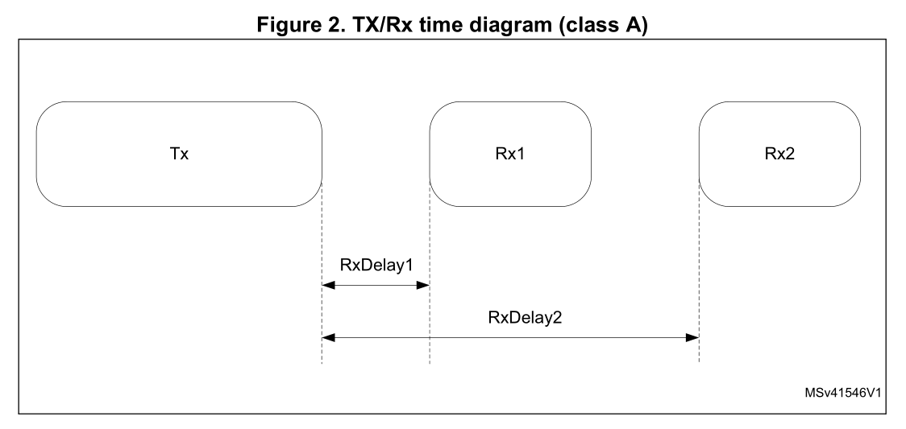
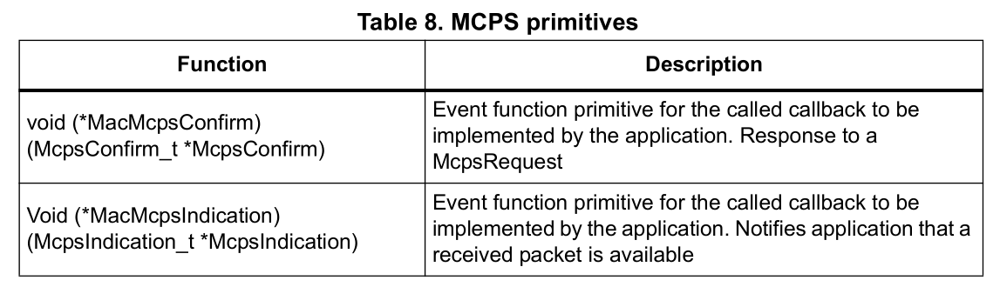

# 用户手册 UM2073 

## STM32 LoRa® 软件扩展 for STM32Cube 

###  介绍

​	本用户手册介绍了STM32Lx系列上的LoRa®扩展包实现; 这个软件被称为I-CUBE-LRWAN。本文还介绍了如何利用LoRaWAN™接口管理LoRa®无线链路。

​	LoRa®是一种无线电信网络，允许以非常低的比特率进行远距离通信，并使电池供电的传感器具有长寿命。LoRaWAN™定义了确保与LoRa®网络互操作的通信和安全协议。 

​	LoRa®扩展包符合LoRa Alliance™的LoRaWAN™的规范协议。

I-CUBE-LRWAN的主要特性如下: 

- 应用程序集成就绪 
- 轻松添加低功耗的LoRa®解决方案
- 极低的CPU负载 
- 无延迟要求
- 小型STM32内存占用 
- 提供低功耗定时服务 

I-CUBE-LRWAN扩展包是基于STM32Cube HAL驱动程序  (参见第二节 ).

​	本用户手册提供了基于Semtech扩展板SX1276MB1MAS，SX1276MB1LAS和SX1272MB2DAS的NUCLEO-L053R8，NUCLEO-L152RE和NUCLEO L476RG的客户应用示例 。

本文档针对以下工具：

- P-NUCLEO-LRWAN1：使用LoRa®技术的STM32 Nucleo软件包 
- B-L072Z-LRWAN1：嵌入CMWX1ZZABZ-091 LoRa®模块（Murata）的STM32发现套件 
- I-NUCLEO-LRWAN1：使用基于WM-SG-SM-42 LPWAN模块（USI®）的TM32 Nucleo的LoRa®扩展板 
- LRWAN-NS1：采用P-NUCLEO-LRWAN3中提供的iSiNGHF®调制解调器RHF0M003的扩展板

## 目录

### 1 概述

​	STM32Cube的I-CUBE-LRWAN扩展包可运行在基于Arm®Cortex®-M处理器的STM32 32位微控制器上。 

#### 1.1 缩略语 

|  Term   |             Definition              |     中文释义     |
| :-----: | :---------------------------------: | :--------------: |
|   ABP   |    Activation By Personalization    |  通过个性化激活  |
|   APP   |             Application             |     应用程序     |
|   API   |  Application programming interface  |   应用程序接口   |
|   BSP   |        Board support package        |     版支持包     |
|   FSM   |        Finite state machine         |    有限状态机    |
|   HAL   |     Hardware abstraction layer      |    硬件抽象层    |
|   IOT   |         Internet of things          |      物联网      |
|  LoRa   |     Long range radio technology     |  远程无线电技术  |
| LoRaWAN |       LoRa wide-area network        |    LoRa广域网    |
|  LPWAN  |     low-power wide-area network     |   低功耗广域网   |
|   MAC   |        Media access control         |   介质访问控制   |
|  MCPS   |      MAC common part sublayer       | MAC通用部分子层  |
|   MIB   |        MAC information base         |   MAC信息基础    |
|  MLME   |   MAC sublayer management entity    | MAC子层管理实体  |
|  MPDU   |       MAC protocol data unit        | MAC协议数据单元  |
|  OTAA   |      Over-this-air activation       |     空中激活     |
|  PLME   | Physical sublayer management entity | 物理子层管理实体 |
|  PPDU   |     Physical protocol data unit     | 物理协议数据单元 |
|   SAP   |        Service access point         |    服务访问点    |

#### 1.2 参考

- LoRa Alliance specification protocol named LoRaWAN version V1.0.2 - 2016, July -
  Final - Released
- IEEE Std 802.15.4TM - 2011. Low-Rate Wireless Personal Area Networks (LR-
  WPANs)

### 2 LoRa标准概述

#### 2.1 概述

​	本节概述了LoRa和LoRaWAN的建议， 特别关注作为本用户手册核心主题的LoRa终端设备。

​	LoRa是一种无线电信网络，旨在允许以非常低的比特率进行远距离通信，并使电池供电的传感器具有长寿命。 LoRaWAN定义了通信和安全协议，确保与LoRa网络的互操作性。

​	LoRa扩展包符合LoRa Alliance规范协议LoRaWAN。

表2显示了LoRa类的使用定义。 有关这些类的更多详细信息，请参阅第2.2.2节。 

表二 ：LoRa类的用途

A类（All）

- 电池供电的传感器或执行器没有延迟限制
- 最节能的通讯类
- 必须得到所有设备的支持 

B类 （Beacon）

- 电池供电执行器。
- 用于延迟控制下行链路的节能通信类
- 基于与网络信标同步的时隙通信。 

C类（Continuous）

- 主驱动的执行器
- 可以持续收听的设备
- 下行链路通信没有延迟 

***注意：虽然LoRa的物理层是专有的，但协议栈（LoRaWAN）的其余部分保持开放，其开发由LoRa Alliance进行的***

#### 2.2 网络结构

​	LoRaWAN网络构成星型拓扑结构的星形，终端设备通过单个LoRa链路连接到一个网关，如图1所示。

[^图1]: 网络图

##### 2.2.1 终端设备结构

​	终端设备由RF收发器（Radio）和主机STM32 MCU组成。 射频收发器由一个调制解调器和一个射频上变频器组成。 MCU实现无线电驱动程序，LoRaWan堆栈和可选的传感器驱动程序。 

##### 2.2.2 终端设备类

LoRaWAN有几种不同类型的端点设备，可满足广泛应用中的不同需求。 

**双向终端设备 -  A类 - （所有设备）**

- A类操作是最低功率的终端设备系统 
- 每个终端设备上行链路传输之后是两个短下行链路接收窗口 
- 终端设备发送上行链路传输后不久，服务器的下行链路通信（请参见图2） 
- 传输插槽基于终端设备（ALOHA类型的协议）自己的通信需求。 

**具有预定接收时隙的双向终端设备 -  B类 - （信标）** 

- 中等功耗 
- B类设备在预定时间打开额外的接收窗口（请参见图3） 
- 为了使终端设备在预定时间打开接收窗口，它会从网关接收时间同步的信标。 

**具有最大接收时隙的双向终端设备 -  C类 - （连续）** 

- 功耗大
- C类终端设备几乎不断打开接收窗口，仅在传输时关闭（参见图4）。

##### 2.2.3 终端设备激活（加入） 

**Over-the-air activation (OTAA)**

​	OTAA是LoRa终端设备加入LoRa网络的加入程序。 LoRa终端设备和应用程序服务器共享相同的密钥，称为AppKey。 在加入过程中，LoRa终端设备和应用服务器交换输入以生成两个会话密钥： 

- 用于MAC命令加密的网络会话密钥（NwkSKey） 
- 用于应用程序数据加密的应用程序会话密钥（AppSKey） 

**个性化激活** (ABP)

​	在ABP的情况下，NwkSkey和AppSkey已经存储在将数据直接发送到LoRa网络的LoRa终端设备中 

##### 2.2.4 区域频谱分配 

​	LoRaWAN规范因地区而异。 欧洲，北美和亚洲市场有不同的频谱分配和监管要求。 更多细节见表3 

#### 2.3 网络层

LoRaWAN体系结构是根据块来定义的，也称为“层”。 每个层都负责标准的一部分，并为更高层提供服务。

终端设备至少由一个嵌入射频收发器的物理层（PHY），一个提供对物理信道访问的MAC子层和一个应用层（见图5）组成。 

##### 2.3.1 物理层（PHY）

物理层提供两种服务：

- 使能物理协议数据单元（PPDU）的Tx / Rx的PHY数据服务
- 实现个人区域网络信息库（PIB）管理的PHY管理服务。 

##### 2.3.1 MAC 子层

MAC子层提供两种服务：

- MAC数据服务，用于跨物理层发送和接收MAC协议数据单元（MPDU）
- 启用PIB管理的MAC管理服务。 

#### 2.4 消息流

本节介绍N用户和N层之间的信息流。 对服务的请求是通过服务原语完成的。 

##### 2.4.1 终端设备激活（加入）流程

在LoRaWAN网络上进行通信之前，必须按照第2.2.3节中所述的两种激活方法之一关联或激活终端设备。

 图6中的消息序列图（MSC）显示了OTAA激活方法。

##### 2.4.2 终端设备数据通信（Class A）

终端设备通过以下方法之一传输数据：通过确认数据消息方法（参见图7）或通过未确认的数据消息（参见图8）。 

在第一种方法中，终端设备需要由接收方完成“确认”（确认），而在第二种方法中，不需要“确认”。

 当终端设备使用“Ackreq”（确认请求）发送数据时，终端设备应在确认持续时间（'AckWaitDuration'）期间等待以接收确认帧（请参阅第4.3.1节：MCPS）。

 如果收到确认帧，则传输成功，否则传输失败。 

#### 2.5 消息流

数据完整性由网络会话密钥（NwkSKey）和应用程序会话密钥（AppSKey）保证。NwkSKey用于加密和解密MAC有效载荷 数据和AppSKey用于加密和解密应用程序有效载荷数据。数据流表示请参见图9。 

NwkSKey在终端设备和网络服务器之间共享。 NwkSKey为通信提供消息完整性，并为终端设备提供网络服务器通信的安全性。

 AppSKey在终端设备和应用程序服务器之间共享。 AppSKey用于加密/解密应用程序数据。 换句话说，AppSKey为应用程序的有效载荷提供了安全性。 这样，终端设备发送的应用程序数据就不能被网络服务器解释。 

### 3 I-CUBE-LRWAN中间件描述 

#### 3.1 概述

此I-CUBE-LRWAN软件包为STM32微控制器提供LoRa堆栈中间件。 这个中间件分成几个模块：

- LoRa Mac层模块 
- LoRa功能模块
- LoRa加密模块 
- LoRa核心模块

LoRa核心模块实现了LoRaMac层之上的LoRa状态机。LoRa堆栈模块与BSP Semtech无线电驱动器模块连接。 

该中间件以源代码格式提供，并且与STM32Cube Hal驱动程序兼容。 

参考图10了解项目文件的结构。 

I-CUBE-LRWAN套件包括： 

- LoRa堆栈中间件 

  > LoRaWAN层 
  >
  > LoRa实用程序，如定时服务器，电源管理和延时管理 
  >
  > LoRa软件加密引擎 
  >
  > LoRa状态机 

- 板级支持包：

  > Radio Semtech驱动
  >
  > 传感器ST驱动程序 

- STM32L0 HAL驱动程序 

- LoRa主要应用示例  

#### 3.2 特性

- 符合的LoRa Alliance的LoRaWAN协议规范 
- 板载LoRaWAN A类和C类协议栈 
- EU 868MHz ISM频段符合ETSI标准 
- 符合EU 433MHz ISM频段的ETSI 
- 美国915MHz ISM频段符合FCC标准 
- 通过无线激活（OTAA）或通过个性化激活（ABP）激活终端设备 
- 自适应数据速率支持 •包含认证测试的LoRaWAN测试应用程序 
- 低功耗优化 

#### 3.3 结构

图11描述了I-CUBE-LRWAN应用程序的主要固件设计。 

HAL使用Cube API来驱动应用程序所需的MCU硬件。 LoRa中间件只包含特定的硬件，因为它必须运行LoRa应用程序。 

RTC提供一个中央时间单元，即使在低功耗模式（停止模式）下也能继续运行。 RTC警报用于在定时服务器管理的特定时间唤醒系统。 

无线电驱动器使用SPI和GPIO硬件来控制无线电（参见图11）。

无线电驱动器还提供了一组供更高级别软件使用的API。

LoRa驱动器由Semtech公司提供，尽管API在STM32Cube HAL上有所修改。 

 无线电驱动器分为两部分： 

- sx1276.c（或sx1272.c）包含所有仅与射频有关的功能
- sx1276mb1mas.c，sx1276mb1las和sx1272mb2das包含所有与无线电板相关的功能 

MAC使用802.15.4模型控制PHY。 MAC与PHY驱动程序接口，并使用定时服务器添加或删除定时任务，并负责'发送时间'。 这一措施确保ETSI规定的占空比限制得到遵守，并执行AES加密/解密算法来封装MAC报头和有效载荷。 

由于控制LoRa A类的状态机很敏感，因此MAC和应用程序之间插入了一个中间级别的软件（lora.c）（参见图11中MAC的“上层”）。 由于现在限制了一组API，用户可以自由地在应用程序级别实现A类状态机。 

该应用程序围绕无限循环建立，管理低功耗，运行中断处理程序（警报或GPIO），并在需要执行任何任务时调用LoRa A类。 此应用程序还实现了传感器读取访问。 

#### 3.4 硬件相关组件

##### 3.4.1 无线电复位

MCU的一个GPIO用于复位无线电。在硬件初始化时（参见表28：LoRa无线扩展板特性和第5.1节：单MCU终端设备硬件描述），此操作只执行一次。 

##### 3.4.2 SPI

sx127x无线电寄存器通过SPI总线以1 Mbit / s的速度访问（参见表28和第5.1节）。 

##### 3.4.3 RTC

RTC日历用作定时器引擎，以32 kHz外部振荡器的所有功耗模式运行。 默认情况下，RTC编程为每秒提供1024个刻度（秒）。 当MCU首次启动时，RTC在硬件初始化时编程一次。 RTC输出仅限于大约48天的32位定时器。

 如果用户需要更改滴答持续时间，请注意滴答持续时间应保持在1毫秒以下。 

##### 3.4.4 中断线

四条GPIO线专用于接收来自无线电的中断（参见表28和第5.1节）。

DIO0用于表示LoRa无线电已成功完成所请求的任务（TxDone或RxDone）。

DIO1用于表示无线电未能完成所请求的任务（RxTimeout）。

在FSK模式下，FIFO级别中断表示FIFO级别已达到预定义的阈值并需要刷新。 

DIO2用于FSK模式，并表示无线电已成功检测到前导码。

DIO3保留供将来使用。 

*注意：LoRaWAN中的FSK模式具有50 kbit / s的最快数据速率。* 

### 4 I-CUBE-LRWAN中间件编程指南 

​	本节介绍LoRaMac层的API。 专用的PHY层（参见第2.1节：概述）不在本用户手册的范围内，必须视为黑匣子 。

#### 4.1 初始化中间件

LoRaMac层的初始化通过'LoraMacinitialization'函数完成。 

该函数执行LoRaMac层的前导运行时初始化，并初始化MCPS和MLME服务的回调原语（请参见表4）。 

#### 4.2 中间件MAC层的功能

所提供的API遵循IEEE802.15.4-2011中定义的“原始”（参见第1.2节“参考资料”）。

通过请求确认和指示响应架构与LoRaMac进行接口连接。 应用层能够执行请求，LoRaMAC层用确认原语来确认。 相反，LoRaMAC层在任何事件的情况下通知具有指示原语的应用层。

 应用层可以响应具有响应原语的指示。 因此所有的确认/指示都是使用回调来实现的。 

LoRaMAC层提供MCPS服务，MLME服务和MIB服务。 

##### 4.2.1 MCPS服务

通常，LoRaMAC层使用MCPS服务进行数据传输和数据接收（见表5）。 

##### 4.2.2 MLME服务

LoRaMAC层使用MLME服务来管理LoRaWAN网络 （见表6）。 

##### 4.2.3 MIB服务

MIB存储重要的运行时信息（如MIB_NETWORK_JOINED，MIB_NET_ID）并保存LoRaMAC层的配置（例如MIB_ADR，MIB_APP_KEY）。 表7列出了提供的API。 

#### 4.3 中间件MAC层的回调

有关LoRaMac用户事件函数原语和回调函数的描述，请参阅第4.1节：中间件初始化。 

##### 4.3.1 MCPS

通常，LoRaMAC层使用MCPS服务进行数据传输和数据接收（见表8）。 

##### 4.3.2 MLME

LoRaMAC层使用MLME服务来管理LoRaWAN网络 （见表9）。 

##### 4.3.3 MIB

N/A

##### 4.3.4 电量

LoRaMAC层需要电池电平测量服务（见表10）。 

#### 4.4 中间件实用功能

提供计时器服务器，以便用户能够请求执行定时任务。 由于硬件定时器基于RTC，因此即使在低功耗模式下，时间也总是被计数。

定时服务器为用户和LoRa堆栈提供可靠的时钟。 用户可以请求与应用程序需要的一样多的定时器。 

提供了四个API，如表11所示： 

计时器服务器位于Middlewares \ Third_Party \ Lora \ Utilities中。 

#### 4.5 中间件实用回调

##### 4.5.1 延迟RX窗口

请参阅第2.2.2节：终端设备类。 有关延迟Rx功能，请参见表12。 

##### 4.5.2 延迟检查MAC层状态

表13给出了MAC层状态延迟的功能 

##### 4.5.3 延迟传输TX帧

表14给出了Tx帧传输的延迟功能。 

##### 4.5.4 延迟RX帧

表15给出了Rx帧的延迟功能。 

#### 4.6 中间件低电量功能

表16中介绍的API允许管理核心MCU的低功耗模式。 

#### 4.7 中间件的终端节点应用程序功能

MAC的接口通过MAC接口文件'LoRaMac.h'完成。

**标准模式**

在标准模式下，提供了一个接口文件（参见图11中的MAC上层），以便用户启动而不用担心LoRa状态机。 接口文件位于Middlewares \ Third_Party \ Lora \ Core \ lora.c中。

接口文件实现：

- 一组允许访问LoRaMAC服务的API
- 应用层不可见的LoRa认证测试用例

**高级模式**

在这种模式下，用户通过在用户文件中包含MAC来直接访问MAC层。

**操作模式**

为这个LoRa End_Node提出的操作模型（参见图12）基于'事件驱动'范例，包括'时间驱动'。 系统LoRa的行为由定时器事件或无线事件加防护转换触发。

**LoRa系统状态行为**

图13描述了Lora End_Node系统状态行为

系统初始化完成后重置时，LoRa End_Node系统进入开始状态定义为'**Init**'。

LoRa End_Node系统在使用“over_the_air_activation（OTAA）”方法时进入加入网络请求并进入定义为“**Sleep**”的状态。 

当使用“个性化激活（ABP）”时，网络已经加入，因此LoRa End_Node系统直接跳转到定义为“**Send**”的状态。 

在定义为“**Sleep**”的状态下，如果终端设备在发生“TimerEvent”时加入了网络，LoRa End_Node系统在进入定义为“**Send**”状态之前进入临时状态，定义为“**Joined**”。

在定义为“**Sleep**”的状态下，如果终端设备在发生“OnSendEvent”时加入了网络，则LoRa End_Node系统会进入定义为“**Send**”的状态。

从定义为“**Send**”的状态，LoRa End_Node系统返回到定义为“**Sleep**”的状态，以便等待与要发送的下一个调度分组对应的'onSendEvent'。

##### 4.7.1 LoRa终端节点的初始化

##### 4.7.2 LoRa终端节点加入请求入口点 

##### 4.7.3 LoRa终端节点开始TX（发送）

#### 4. 8 LIB 终端节点应用程序回调

##### 4.8.1 当前电量

表20显示了当前的电池电量功能。 

##### 4.8.2 当前温度水平

##### 4.8.3 板标识符（Board unique ID）

表22显示了该板的唯一ID功能。 

##### 4.8.4 板级随机种子（Board Random seed）

表23给出了板级随机种子功能。 

##### 4.8.5 制作RX帧

表24显示了make Rx帧功能。

 

##### 4.8.6 请求转换类模式

##### 4.8.7 终端节点类模式更改确认

### 5 示例描述

#### 5.1 单MCU设备硬件描述 

应用层，Mac层和PHY驱动器在一个MCU上实现。 End_Node应用程序正在实施该硬件解决方案（参见第5.4节） 

I-CUBE-LRWAN可在多个平台上运行，例如：

- STM32 Nucleo平台与LoRa无线电扩展板叠加
- B-L072Z-LRWAN1探索板（不需要LoRa扩展板）

可选择在Nucleo和Discovery板上添加ST X-NUCLEO-IKS01A1传感器扩展板。

表27列出了基于Nucleo的支持硬件。

> 1.此特定配置可作为套件P-NUCLEO-LRWAN1购得。

I-CUBE-LRWAN扩展包可以轻松地适用于任何其他支持的设备和开发板。

表28描述了LoRa无线扩展板的主要特性。

无线电接口描述如下：

- 无线电寄存器通过SPI访问
- 三条中断线是强制性的：DIO0，DIO1和DIO2。 DIO3，DIO4和DIO5线路对于运行LoRa链路并不重要，因为在此应用中只使用DIO0，DIO1和DIO2 
- MCU的一个GPIO用于重置无线电
- 一个MCU引脚用于控制天线开关将其设置为Rx模式或Tx模式。

硬件映射在硬件配置文件中描述如下：

- End_Node项目的Projects \ Multi \ Applications \ LoRa \ classA \ inc \ platform_hw_conf.h
- PingPong项目的Projects \ Multi \ Applications \ LoRa \ PingPong \ inc \ platform_hw_conf.h

在上述任何位置，平台可以是STM32L0xx，STM32L1xx，STM32L4xx或MLM32L0xx（Murata调制解调器设备）。

**中断**

表29显示了适用于Cortex系统处理器异常和STM32L0系列LoRa应用程序特定中断（IRQ）的中断优先级。

#### 5.2 分体式终端设备硬件描述（双MCU解决方案）

应用程序层，Mac层和PHY驱动程序是分开的。 LoRa End_Node由一个LoRa调制解调器和一个主机控制器组成。 LoRa调制解调器运行Lora堆栈（Mac层和Phy层），由实现应用层的Lora主机控制。

在NUCLEO板上实现Lora主机的AT_Master应用程序与AT_Slave应用程序兼容（见5.6节）。 AT_Slave应用程序在CMWX1ZZABZ-091 LoRa模块（Murata）上演示调制解调器。 AT_Master应用程序还兼容USI的WM-SG-SM-42 LPWAN模块的I-NUCLEO-LRWAN1扩展板，以及具有P-NUCLEO-LRWAN3中提供的RiSiNGHF调制解调器RHF0M003的LRWAN_NS1扩展板（参见第5.7节）

这种拆分解决方案允许设计应用层，而不受任何与LoRaWAN堆栈的实时需求相关联的约束。 

LoRa调制解调器和LoRa主机之间的接口是一个运行AT命令的UART。 

#### 5.3 包描述

当用户解压I-CUBE-LRWAN时，包装呈现如图15所示的结构。

I-CUBE-LRWAN软件包包含四个应用程序：End_Node，PingPong，AT_Slave和AT_Master。 对于每个应用程序，可以使用三种工具链：MDK-ARM，IAR和SW4STM32。 

#### 5.4 终端节点应用程序

此应用程序通过I2C读取传感器的温度，湿度和大气压力。 MCU通过VREFLNT测量供电电压，以计算电池电量。 这四个数据（温度，湿度，大气压力和电池电量）使用868 MHz的A类LoRa无线电定期发送到LoRa网络。

为了启动LoRa End_Node项目，用户应该转到\ Projects \ Multi \ Applications \ LoRa \ End_Node并选择他最喜欢的工具链文件夹（在IDE环境中）。 用户然后从合适的目标板选择LoRa项目。

##### 5.4.1 激活方法和密匙

有两种方法可以通过OTAA或ABP在网络上激活设备。

文件\ Projects \ Multi \ Applications \ LoRa \ End_Node \ commissioning.h收集所有与设备激活相关的数据。 所选方法和调试数据一起打印在虚拟端口上，并可以再终端上看到。

##### 5.4.2 调试开关

用户必须转到\ Projects \ Multi \ Applications \ LoRa \ End_Node \ inc \ hw_conf.h以通过注释启用调试模式或/和跟踪模式

\#define DEBUG / #define TRACE。

即使MCU处于低功耗状态，调试模式也会启用DBG_GPIO_SET和DBG_GPIO_RST宏以及调试器模式。 跟踪模式启用DBG_PRINTF宏。

注意：为了实现真正的低功耗，上面提到的“#define”必须注释掉。

##### 5.4.3 传感器开关

当没有传感器扩展板插入设置时，必须在\ Projects \ Multi \ Applications \ LoRa \ End_Node \ inc \ hw_conf.h中注释#define SENSOR_ENBALED。

表30提供了应用程序配置的主要选项的摘要。

注意：

允许的最大有效载荷长度取决于区域和选定的数据速率，因此必须根据这些参数仔细设计有效载荷格式。

#### 5.5 PingPong 应用程序描述

此应用程序是两个LoRa终端设备之间的简单Rx / Tx RF链路。 默认情况下，每个LoRa终端设备作为主设备启动并发送“Ping”消息并等待答案。 接收到'Ping'消息的第一个LoRa终端设备成为从设备，并用'Pong'消息回复主设备。 PingPong然后开始。

为了启动PingPong项目，用户必须进入'\ Projects \ Multi \ Applications \ LoRa \ PingPong'文件夹并按照与LoRa End_Node项目相同的步骤启动首选工具链。

硬件和软件设置环境

要设置STM32LXxx-NUCLEO，请将NUCLEO（或B-L072Z-LRWAN1）板连接到计算机，并使用USB电缆类型A到mini B连接到ST-LINK连接器（CN1）。 确保安装了CN2 ST-LINK连接器跳线。 有关PingPong设置的表示，请参见图16。

#### 5.6 AT_Slave 应用程序描述

这个例子的目的是通过外部主机通过UART实现由AT命令接口控制的LoRa调制解调器。

外部主机可以是嵌入应用程序和AT驱动程序的主机 - 微控制器，也可以是执行终端的计算机。

此应用针对嵌入CMWX1ZZABZ-091 LoRa模块的B-L072Z-LRWAN1探索板。此应用程序使用针对STM32L072CZ的多维数据集低层驱动程序API来优化代码大小。

AT_Slave示例实现了驱动内置LoRa无线电的Lora堆栈。该堆栈通过UART上的AT命令接口进行控制。调制解调器始终处于停止模式，除非它处理来自外部主机的AT命令。

为了启动AT_Slave项目，用户必须进入'\ Projects \ Multi \ Applications \ LoRa \ AT_Slave'文件夹，并按照与LoRa End_Node项目相同的步骤启动首选工具链。

有关更多详细信息，请参考应用笔记AN4967，其中列出了AT命令及其说明

#### 5.7 AT_Master 应用程序描述

此应用程序的目的是读取传感器数据并通过外部Lora调制解调器将它们发送到Lora网络。 AT_Master应用程序实现了一套完整的AT命令来驱动嵌入在外部LoRA调制解调器中的LoRa堆栈。

外部LoRA调制解调器的目标是B-L072Z-LRWAN1探索板或I-NUCLEO-LRWAN1板（基于WM-SG-SM-42 USI模块）或者具有RiSiNGHF®调制解调器的LRWAN-NS1扩展板P-细胞核 - LRWAN3。

该应用使用针对STM32L0系列的STM32Cube HAL驱动程序API。

有关更多详细信息，请参考应用笔记AN4967，其中列出了AT命令及其说明。

**BSP编程指南** 

表31给出了与外部LoRa模块接口的BSP（板级支持包）驱动程序API的描述。 

注意事项：NUCLEO板通过UART（PA2，PA3）与扩展板通信。 应适用下列修改：（参见UM1724的第5.8章）。 

> 应关闭SB62和SB63
>
> 应该打开SB13和SB14以断开STM32 UART与STLINK的连接

### 6 系统性能

#### 6.1 内存占用

表32的值是依据keil编译器测出来的（ARM compiler 5.05 
）

- 最优化：优化级别为3
- 调试选项：关
- 追踪选项：关
- 测试目标：P-NUCLEO-LRWAN1 (STM32L073+ SX1272MB2DAS) 


| 项目         | Flash(bytes) | RAM(bytes) | 描述                     |
| :----------- | ------------ | ---------- | ------------------------ |
| 应用层       | 8736         | 1217       | 包括所有的microlib       |
| LORA栈       | 18852        | 2681       | 包括MAC+RF驱动           |
| 硬件抽象层   | 11030        | 4          | -                        |
| 所有应用程序 | 38618        | 3902       | 所有应用程序所占用的内存 |

#### 6.2 实时约束

LoRa RF异步协议意味着遵循严格的TX / Rx时序建议（参见图17中的Tx / Rx图示例）。 SX1276MB1MAS扩展板已针对用户透明，低锁定时间，和快速自动校准操作进行了优化。 LoRa扩展包设计集成了发射器启动时间和接收器启动时间限制。 

**Rx窗口通道启动** 

Rx窗口在上行链路调制结束后打开RECEIVE_DELAY1 1秒钟（+/- 20微秒）或JOIN_ACCEPT_DELAY1 5秒钟（+/- 20微秒）。

 当前的调度中断级优先级必须得到遵守。 换句话说，所有新的用户中断必须具有中断优先级> DI0#n中断（见表29），以避免延迟接收到的启动时间。 

#### 6.3 电量消耗

与SX1276MB1MAS屏蔽层相关的Nucleo板的功耗测量已经建立。

**测量设置**：

- 没有DEBUG
- 没有TRACE
- 没有SENSOR_ENABLED

**测量结果**：

- 停止模式下的典型功耗：1.3μA
- 运行模式下的典型功耗：8.0 mA

**测量数据**：

- 瞬间消耗超过30秒

图17显示了STM32L0系列微控制器的电流消耗与时间关系的示例。 

### 7 修订记录

略