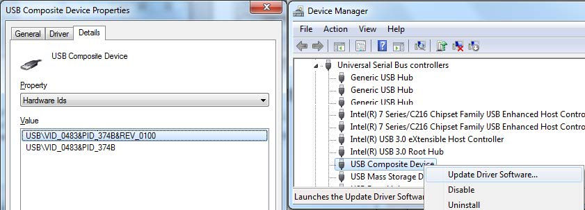

## **UM2115用户手册——支持LoRaWAN和 LPWAN协议的STM32L0探索套件**

### **前言** 

- [B-L072Z-LRWAN1探索套件](http://www.st.com/content/st_com/zh/products/evaluation-tools/product-evaluation-tools/mcu-eval-tools/stm32-mcu-eval-tools/stm32-mcu-discovery-kits/b-l072z-lrwan1.html)采用了 [Murata](http://www.murata.com/)公司的CMWX1ZZABZ-091 LoRa模块。该探索套件允许用户可以在一个单独模块中轻松开发使用STM32L072CZ和LoRa RF射频连接的应用程序。

- **B-L072Z**-LRWAN1探索套件具有STM32L0系列提供的全部功能，并提供超低功耗和LoRa RF射频功能。B-L072Z-LRWAN1探索套件是低成本且易于使用的开发套件，可快速评估和开始开发STM32L072CZ微控制器。

- B-L072Z-LRWAN1探索套件包括 LoRa RF射频接口、LED、按钮、天线、Arduino Uno V3连接器和Micro-B USB 2.0 FS接口。板载的ST-LINK/V2-1为STM32L0微控制器提供了在线调试器和编程器。

- LoRaWAN堆栈符合A级和C级认证。它在I-CUBE-LRWAN固件包内。
- B-L072Z-LRWAN1探索套件可直接访问<http://mbed.org>上ARM mbed的在线资源以及若干示例，帮助用户设置完整的LoRaWAN节点。

**图 1. B-L072Z-LRWAN1 LoRa探索套件** 

 

### **1、功能** 

B-L072Z-LRWAN1探索板具有以下功能：

•        Murata 村田公司的CMWX1ZZABZ-091 LoRa模块：

–        采用超低功耗**STM32L072CZ**系列微控制器，基于ARM Cortex-M0+内核，具有192 KB的闪存，20 KB RAM，20 KB EEPROM

–        USB 2.0 FS

–        4通道12位的ADC，两路ADC

–        6位定时器、LP-UART、I2C和SPI

–        板载**SX1276**收发器

–        **LoRa、FSK、GFSK、MSK、GMSK和OOK调制**

–        +14 dBm或+20 dBm可选输出功率

–        最大链路预算为157 dB

–        可编程位速率高达300 Kbit/s

–        高灵敏度：低至-137 dBm

–        防弹前端：IIP3 = -12.5 dBm

–        89 dB的抗阻塞能力

–        低RX电流为10 mA，寄存器保持为200 nA 

–        完全集成的合成器，分辨率为61 Hz 

–        内置用于时钟恢复的位同步器

–        同步字识别

–        前导码检测

–        127 dB+动态范围RSSI 

•        SMA和U.FL射频接口连接器

•        包括50欧姆SMA射频天线

•        板载ST-LINK / V2-1仿真器/编程器，支持USB重新枚举功能：大容量存储设备、虚拟串口和调试端口

•        探索板供电电源：

–        USB ST LINK/V2-1

–        USB FS接口

–        来自Arduino Uno V3连接器的 外部VIN

–        CN13接口的外部3.3 V

–        USB充电器

–        电池

•        3xAAA型电池座，用于独立操作

•        7个LED指示灯：

–        4个通用LED

–        1个5V供电的LED 

–        1个ST-LINK通信LED 

–        1个故障电源LED 

•        2个按钮（用户和复位）

•        **Arduino Uno V3**连接器

•        支持ARM mbed（详见 <http://mbed.org>）

### **2 、产品标记**

标记为“ES”或“E”的评估工具尚未合格，因此它们还没有准备好用作参考设计或生产。 任何由此类使用产生的后果ST不会负责。 在任何情况下，ST不会对使用这些工程样品工具作为参考设计或生产的任何客户负责。

“E”或“ES”标记位置示例如下：

- 在电路板上焊接的目标STM32上（有关STM32标记的说明，请参见[www.st.com](http://www.st.com)上STM32数据手册的“封装信息”部分）。

- 在评估工具订购编号旁边，粘贴或丝印在电路板上

### **3、约定**

**表 1. ON/OFF约定** 

|    约定     |      定义       |
| :---------: | :-------------: |
| 跳线 JPx ON |    安装跳线     |
| 跳线JPx OFF |   未安装跳线    |
| 焊桥SBx ON  | 使用焊锡连接SBx |
| 焊桥SBx OFF |   SBx连接断开   |

### **4、系统要求**

-  Windows操作系统（XP、7、8、10）， 64位Linux或者OS X
- USB Type-A转Micro-B电缆

### **5、开发环境**

- [Keil MDK-ARM](http://www.keil.com/)
- IAR EWARM
- 基于GCC的IDE，包括AC6公司的SW4STM32免费版
- ARM  mbed在线编译环境

### **6 、演示软件** 

- 演示软件预装在STM32闪存中。 可以在[www.st.com/i-cube-lrwan](http://www.st.com/i-cube-lrwan)网页下载最新版本的演示源代码和相关文档。 

- 实例mbed OS实例：https://os.mbed.com/teams/mbed-os-examples/ 

### **7、订购和产品信息** 

> 在安装和使用本产品之前，请接受[www.st.com/stm32app-discovery](http://www.st.com/stm32app-discovery)网页的评估产品许可协议。
>
> 有关STM32L072探索套件的更多信息，请访问[www.st.com/stm32app-discovery](http://www.st.com/stm32app-discovery) 网页。
>
> 要订购B-L072Z-LRWAN1探索套件，请参考表2。

**表 2. 订购信息** 

|    **RPN**     | **目标STM32** |
| :------------: | :-----------: |
| B-L072Z-LRWAN1 |  STM32L072CZ  |

### **8、硬件布局和配置** 

B-L072Z-LRWAN1探索套件围绕Murata村田的LoRa模块设计，包括采用49引脚WLCSP封装的STM32L072CZ微控制器。

图2显示了Murata村田的LoRa模块与外设（ST-LINK / V2、RF天线、LED、按钮、USB 2.0 FS Micro-B连接器、3xAAA电池座）之间的连接。

图3和图4帮助用户在STM32L072探索套件上找到这些功能。

**图 2. 硬件框图** 

**图 3. B-L072Z-LRWAN1顶层布局**  

 

**图 4. B-L072Z-LRWAN1底层布局** 

####  **8.1、B-L072Z-LRWAN1探索套件机械尺寸图** 

 

#### **8.2、嵌入式ST-LINK/V2-1** 

B-L072Z-LRWAN1探索套件集成了ST-LINK / V2-1编程和调试工具。 与ST-LINK/V2相比，变化如下：

- ST-LINK / V2-1支持的新功能：

> USB软件重新枚举
>
> 在USB上虚拟COM端口
>
> 在USB上的大容量存储接口
>
>  USB端口上需求超过100mA的电流的USB电源管理

- ST-LINK / V2-1不再支持这些功能：

> SWIM接口
>
> 应用电压低于3 V

欲了解有关V2和V2-1版本两者通用的调试和编程功能的基本信息，请参考用于STM8和STM32的ST-LINK / V2在线调试器/编程器用户手册（UM1075）。

##### **8.2.1、驱动程序** 

ST-LINK/V2-1需要一个专用的USB驱动程序，可以在[www.st.com](http://www.st.com)找到适用于Windows XP、 7、8和10的驱动程序。

在安装驱动程序之前，当B-L072Z-LRWAN1探索套件连接到PC时，在PC的设备管理器中一些B-L072Z-LRWAN1接口有可能显示为“未知设备”。在这种情况下，用户必须安装驱动程序文件，并从设备管理器更新连接设备的驱动程序。

**注：** 推荐使用“USB复合设备”进行全面修复。

#####  **8.2.2、ST-LINK/V2-1固件更新**

ST-LINK/V2-1集成了一个固件升级机制，用于通过USB端口进行原位升级。由于固件可能在ST-LINK/V2-1的生命周期内发生变化（比如新的功能、错误修复、支持新的微控制器系列），推荐在开始使用B-L072Z-LRWAN1探索板时，访问[www.st.com](http://www.st.com)以保持最新的固件版本，且定期回访。

#### **8.3、电源** 

****

B-L072Z-LRWAN1探索套件设计为以多种方式供电。  只需要使用一条Micro-B USB电缆插入到 PC的USB端口。 在这种模式下，通过CN7上的ST-LINK / V2-1  USB端口对电路板进行编程和调试。 可以使用以下不同供电方式的任意一个：

- 连接到CN13的外部+3.3 V（必须连接CN13的+3.3 V和GND引脚）
- 在Arduino Uno V3连接器上插入7-12 V直流电源：CN4的8脚VIN和7脚GND（VIN 和GND引脚必须都连接）
- CN11连接器上的USB 2.0 FS Micro-B（设备模式）。电源由连接到CN11的USB端口提供。
- 位于探索套件底部的板载3xAAA大小的电池座BT1（电池不包含在探索套件包装内）。 请注意电池盒中提到的电池极性。
- 限制的5V ST_LINK直流电源，来自ST-LINK USB接口。 ST-LINK /  V2-1的USB型Micro-B连接器CN7。如果USB枚举成功（如下所述），通过置位PWR_ENn信号来使能ST-LINK  5V链路电源。该引脚连接到电源开关芯片(ST890)，该芯片向电路板供电。该电源开关芯片还有电流限制的功能，一旦电路板发生短路（超过625mA）时保护PC。探索套件可以通过ST-LINK  USB连接器供电，但是在USB枚举之前只有ST-LINK电路部分有电，因为那时主机PC只向电路板提供100  mA电流。在USB枚举期间，探索套件需要主机PC提供300  mA电流。如果主机能够提供所需的功率，则通过“SetConfiguration”命令完成枚举过程，然后电源开关管ST890接通，红色LED  LD7接通，因此探索套件可以消耗最大300mA的电流，但不能再多。如果主机不能提供所需的电流，枚举过程将会失败。因此，ST890保持断开，并且STM32部分包括扩展板都不会通电。因此，红色LED  LD7保持熄灭。在这种情况下，必须使用外部电源。

为了进一步降低电路板的电流消耗，必须通过打开SB18断开LED7。

用户不必通过跳线或开关管理不同的配置。电源由相应电源分支上的一组二极管内部管理。

如果电路板由CN13、电池或CN11供电，则必须拆下SB37才能释放由ST-LINK管理的RESET引脚。 在这种情况下，ST-LINK不再供电。

只要存在上述电源之一，就会点亮红色LED LD7（+5 V电源）（SB18接通）。

*注意：探索套件必须由符合EN-60950-1：2006 + A11 / 2009标准的电源模块或辅助设备供电，并且必须是具有限制功率能力的安全超低电压（SELV）。*

#### **8.4、IDD测量**

B-L072Z-LRWAN1探索套件的功耗是以三个连接器（最初未安装）JP1、JP2和JP3  的平均值来衡量。这三个连接器分别连接到电源输入VDD_RF_LRA、VDD_USB_LRA和LoRa模块的  VDD_MCU_LRA。目的是分别检测分支的不同功耗，分支分为三个部分：RF、USB和MCU。为了能够在需要进行测量的每个分支中插入万用表，用户必须移除默认配置中最初连接JPx连接器的相关焊桥。

表3总结了一些可能的配置：

**表 3. IDD测量和焊桥配置** 

| **跳线名称**    | **状态**         | **IDD测量**     |
| --------------- | ---------------- | --------------- |
| JP1 VDD_RF_LRA  | SB17 ON （默认） | N/A             |
|                 | SB17 OFF         | IDD VDD_RF_LRA  |
| JP2 VDD_USB_LRA | SB19 ON （默认） | N/A             |
|                 | SB19 OFF         | IDD VDD_USB_LRA |
| JP3 VDD_MCU_LRA | SB14 ON （默认） | N/A             |
|                 | SB14 OFF         | IDD VDD_MCU_LRA |

#### **8.5、时钟源** 

当使能时，Murata LoRa 模块嵌入了自己的TCXO，工作频率为32 MHz。

TCXO既可以由STM32的引脚PA12控制（当JP9的引脚1连接到JP9的引脚2），也可以总是使能（当JP9的引脚2连接到JP9的引脚3）。 有关跳线的描述，请参见表10。

当STM32需要一个精确的外部高速时钟时，通过连接SB13，TCXO_OUT时钟引脚由模块引脚PH0_OSC_IN提供。

如果需要，B-L072Z-LRWAN1探索套件可以配备外部晶体振荡器。 可以在电路板上添加一个带有20 pF电容的8 MHz振荡器（默认情况下，未安装X1、C1和C2），以满足用户需求。

#### **8.6、复位源**

B-L072Z-LRWAN1探索套件的复位信号是低电平有效，复位源可以是以下之一：:

- 复位按钮B2
- CN4的Arduino Uno V3扩展板
- 来自STSAFE安全IC或STM32L072CZ微控制器（可通过跳线JP10选择）的LoRa模块的内部复位
- 板载的ST-LINK/V2-1 

#### **8.7、天线和RF连接**

B-L072Z-LRWAN1探索套件包含一根粗短的900  MHz  50欧姆天下，当进行任何RF通信时必须连接到SMA接口CN10。RF信号设计有两个路径（图7中的蓝色箭头），默认路径连接到SMA连接器的输出（图7中的红色箭头），第二个路径是U.FL连接器CN9（图7中的绿色箭头）。每个RF信号路径包括天线匹配电路，可以由高级用户安装和进行调整

最初，默认路径将LoRa模块RF信号通过安装在C14和C15的0欧姆电阻连接到SMA连接器。  请注意，如图7所示，C13和C14在天线电路布局上有一个公共焊盘。  如果用户想要连接U.FL连接器而不是SMA，则他们需要通过C13重定向RF信号，然后在预期的封装上旋转组件。

**图7. RF信号路径和连接** 

#### **8.8、虚拟COM端口**

串行接口USART2可直接作为PC的虚拟COM端口，连接到ST-LINK / V2-1 USB连接器CN7。 有关配置详细信息，请参考“[用于STM32Cube的STM32 LoRa软件扩展用户手册（UM2073）](http://www.st.com/resource/en/user_manual/dm00300436.pdf)”。 

#### **8.9、按钮和LED**

位于探索套件顶部的黑色按钮B2可复位STM32L072CZ微控制器。

位于顶部的蓝色按钮B1可用作数字输入或唤醒替代功能。 当按下按钮时，逻辑状态为1，否则逻辑状态为0。

默认情况下，用户按钮连接到PB2，它也可以连接到PA0作为唤醒源。 在这种情况下，必须拆下SB31，并安装SB30。

可以使用位于顶部的七个LED，其中四个是用于用户需求的通用LED。 要点亮LED，在相应的GPIO寄存器中写入高逻辑状态1。 表4显示了LED指示灯的控制端口的分配。

**表4. 控制端口的分配**

| **参考标号** | **颜色**  | **名称**    | **注释/功能** |
| ------------ | --------- | ----------- | ------------- |
| B1           | 蓝色      | USER        | 复用功能唤醒  |
| B2           | 黑色      | RESET       | 微控制器复位  |
| LD1          | 绿色      | GP          | 用户自定义    |
| LD2          | 绿色      | GP          | 用户自定义    |
| LD3          | 蓝色      | GP          | 用户自定义    |
| LD4          | 红色      | GP          | 用户自定义    |
| LD5          | 红色/绿色 | ST-LINK COM | 通信时为绿色  |
| LD6          | 红色      | 故障电源    | 超过625mA电流 |
| LD7          | 红色      | 5 V电源     | 5 V电源       |

#### **8.10、USB FS**

B-L072Z-LRWAN1电路板通过USB Micro-B连接器支持USB FS 2.0通信。 当B-L072Z-LRWAN1电路板作为USB设备时，VBUS由另一个USB主机供电。

**注:** *当B-L072Z-LRWAN1电路板通过USB FS连接器（CN11）由外部电源供电时，在设备模式下，如果电流消耗大于100 mA，则不要使用PC作为电源，否则PC 可能会损坏。*