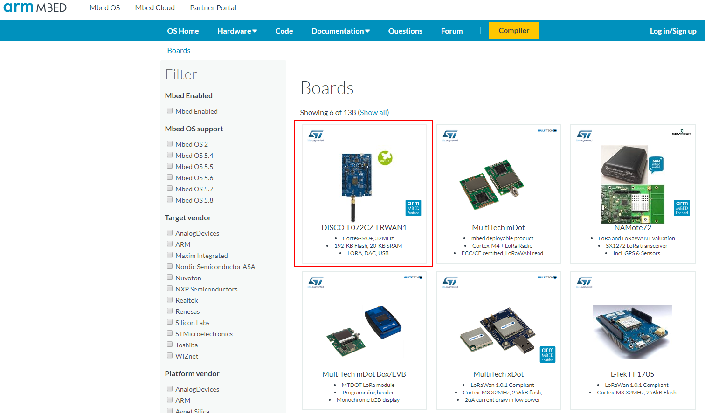
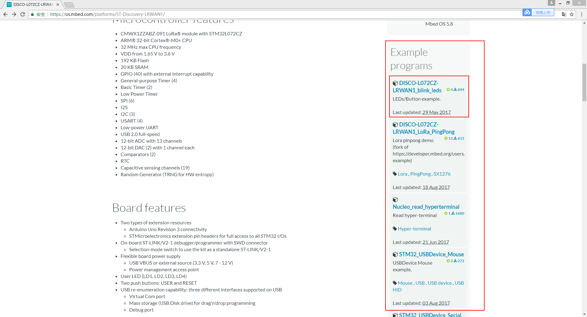

## 使用Mbed在线编译器开发第一个示例程序--流水灯

#### 开始之前：

##### **安装驱动程序**

> 链接：https://pan.baidu.com/s/13og6nD8zq6VmNAAiKxeX7g 
>
> 密码：eww3
>
> 下载后解压后，以**管理员身份运行**即安装驱动程序

##### **注册到Mbed OS**

> 浏览器打开https://os.mbed.com/account/signup/注册

##### **将开发板添加到账户**

> 装好驱动之后，连接设备到pc
>
> 在我的电脑中打开开发板对应的移动盘
>
> 浏览器打开文件即可

### 1、打开os.mbed.com，点击Hardware-->boards

### 2、选择示例程序

左侧filter勾选Lora，选择我们的开发板DISCO-L072CZ-LRWAN1

我们可以看到右侧有许多示例程序，点击再点击即可在在线编译器中看到项目我们引入的项目

### 3、认识**online compiler**

### 4、编译和运行

点击菜单栏的compile按钮，编译完成后会自动弹出下载对话框。将下载的文件复制到设备中即可。若设备没有自动运行，需手动按开发板上的reset按钮。

**note：在compiler页面点击输入关键字可以查找更多的示例代码。**

